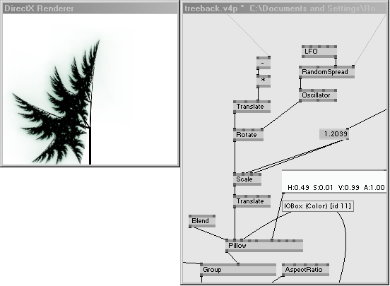
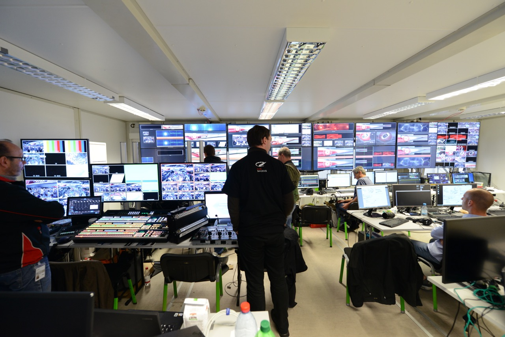

% Developing F# on NixOS
% Karsten Gebbert
% 27/10/2015

# Hi.

*****

#### @barfton
#### k@ioctl.it
#### https://github.com/krgn

*****

> - Nsynk GmbH
> - background in music, arts and computing
> - functional programming
> - interested in systems programming, distributed computing, web, a/v, the
>   whole thing
> - using NixOS properly since summer 2015

Introductions:
- my background in arts, music, computing
- interests
- my usage of NixOS
    * mainly as a development platform
    * use VMs for Windows-based work
    * my experiences reflect a new user story

*****

- a few words about iris
- distributed system of VVVV renderers
- used for playback of high-quality (4K) video streams, potentially with 3d
- rendered overlays and integration with all kinds of other systems
- (sensors, kinetics etc)

*****

***** 

### Who? Why?

> - introduction to developing F# on NixOS
> - I am not a Nix(OS) or F\# expert or .NET veteran (yet)
> - sharing my personal experience and impressions while getting some work done
> - approaches taken have a few rough edges, so please help me improve it!
> - it is my first experience of this kind, so please do criticize me (gently)

*****

### What?

> - explore some basic aspects of F#
> - look some F# libraries and code
> - examine packaging strategies using nix
> - show how construct a small service
> - simple deployment using nix

* 

