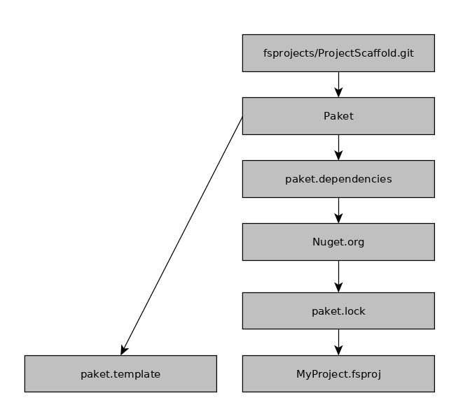

## F\# and Nix

*****

> - F# is packaged separately from mono (and should be)
> - no single GAC (Global Assembly Cache) for all .NET packages
> - package management is _Nuget_ + _$IDE_
> - Nuget distributes compiled byte-code
> - _Paket_ is a very promising replacement (fixes _DLL_ hell)

<div class="notes">
* _Paket_ resolves the dependency graph at the solution level
* manages references of projects

</div>
*****

#### Common Project Workflow



<div class="notes">
* works for local development
* uses FAKE (f# based build system) (build.sh)
* `paket` phones home *every* single time it is run
* `paket` targets are also included into each project file
* will *NOT* work well in nix-land
</div>

*****

#### But, Nix?

*****

To use _nix_ for package management we will need to: 

> 1) create and maintain packages for nuget dependendcies
> 2) generate reference entries in .fsproj files linking-in store paths to _DLLs_
> 3) repeat process for all dependencies

<div class="notes">
* SHOW EXAMPLE .fsproject
* SHOW EXAMPLE .sln
* SHOW EXAMPLE paket.references/.lock/.template
* automating the process with the right tooling ;)
* paket already manages references 
</div>

***** 

> - some work towards that end has already been done already
> - But! Very few packages exist now
> - it is somewhat orthogonal to how people develop
> - not enough incentive to get everything packaged

<div class="notes">
- not trivial to parse and edit xml project files
- re-implements a lot of functionality already in paket
- disagreement?
- discussion?
- different points of view on that matter?
- Nuget API for automating packaging
</div>

*****

#### The (obvious) solution

> - use _Paket_ :)
> - lift nuget packages into the store
> - link packages into the _packages_ directory at build time
> - disable nuget/paket
> - use xbuild instead of FAKE

*****

#### Paket2Nix

```
https://github.com/krgn/Paket2Nix
```

*****

> - uses Paket metadata, the .lock file in particular
> - discovers projects and their metadata
> - generates Nix expressions for all dependencies project code (one per project)
> - creates wrapper scripts for executables

<div class="notes">
* there is resolv.conf in the chroot/sandbox, so no network
* no paket and no nuget
* tl;dr it doestn't work
* References in XML project files
* currently for Paket is the Way-To Go™ for development
* solves common problems in .NET development (consistent dependency trees)
* integreate with Paket for maximum flexibility
* inter-op with non-nix platforms
</div>
