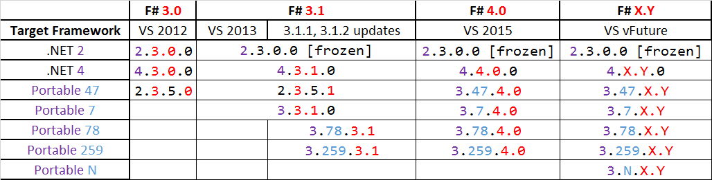

# Demo

#### Proposition

Assume we have a lots of great computer science papers on our SSD, and we'd like to be
able to index and query for information (e.g. [1]) via _curl_.

So, lets build a small microservice around the _recoll_ full-text indexer and
serve query results via HTTP.

<div class="notes">
- olli charles' git-annex
- idea could at transferred to some more relevant technology like, e.g., _elasticsearch_ 
- from there, it might be interesting to go on to explore clustering and config management with nix
</div>

*****

#### Using Project Scaffold

```{.fsharp}
git clone git@github.com:fsprojects/ProjectScaffold.git PaperScraper
```

```{.fsharp .fragment}
cd PaperScraper && ./build.sh
```

*****

Answer a couple of questions and you're set. But wait!

*****


*****

```error : Target named 'Rebuild' not found in the project.```

*****

#### A Note About Build Targets

Since in _NixOS_ there is no(t one, but many) Global Assembly Cache, resolving
default build targets shipped with _F#_ does not work as expected.

*****

The solution is to patch all _.fsproj_ files in the solution and only
conditionally set the _FSharpTargetsPath_ if the target actually exists:

```
- <FSharpTargetsPath>$(MSBuildExtensionsPath32)\Microsoft\VisualStudio...
+ <FSharpTargetsPath Condition="Exists('$(MSBuildExtensionsPath32)\M...
```

*****

There is a package _nix_ written by _@obadz_ which contains a script that finds
and patches up _.fsproj_ files to look out for the _FSharpTargetsPath_
enviroment variable.

```→ nix-env -i dotnetbuildhelpers```

*****

#### Usage: 

```
→ patch-fsharp-targets.sh
  Patching F# targets in fsproj files...
  ./src/PaperScraper/PaperScraper.fsproj
  ./tests/PaperScraper.Tests/PaperScraper.Tests.fsproj
```

*****

Last, we only need to set _FSharpTargetsPath_ in our shell:

```{.shell}
→ export FSharpTargetsPath=$(dirname $(which fsharpc))/../lib/mono/4.5/Microsoft.FSharp.Targets
```

```{.shell .fragment}
→ set -x FSharpTargetsPath (dirname (which fsharpc))/../lib/mono/4.5/Microsoft.FSharp.Targets
```

```{.shell .fragment}
{ config, pkgs, ... }:
{
  environment.variables.FSharpTargetsPath = "${pkgs.fsharp}/lib/mono/4.5/Microsoft.FSharp.Targets";
}
```

*****

#### Hm, More Errors

Unfortuantely, more problems crop up at this point.

- FSharp.Core dll is missing when running tests, hence the build fails
- FSharp.Core dll is missing when generating documentation, hence the build fails

:(

<div class="notes">
- mono crashes really hard running the tests
</div>

*****

#### Ah yes!

> "In compiled applications, you should never assume that FSharp.Core is in the
> GAC ("Global Assembly Cache"). Instead, you should deploy the appropriate
> FSharp.Core as part of your application."

https://fsharp.github.io/2015/04/18/fsharp-core-notes.html

*****

#### Quick Fix:

Ship _FSharp.Core_ as part of the build output and manage the dependency with _paket_.

```{.fragment}
in paket.dependencies, add;

FSharp.Core = 4.0.0.1
```
```{.fragment}
in src/PaperScraper/paket.references, add:

FSharp.Core
```

```{.fragment}
<Reference Include="FSharp.Core">
  <Private>True</Private>
  <HintPath>..\..\packages\FSharp.Core\lib\net40\FSharp.Core.dll</HintPath>
</Reference>
```

<div class="notes">
- add the FSharp.Core and verision to paket.dependencies
- add the FSharp.Core to paket.references in the project and tests project
- make sure to set TargetFSharpCoreVersion to the correct version!
- execute paket install again
- mono crashes really hard running the tests
</div>

*****

#### A Better™ Fix:

It would be better to use the F# version shipped with NixOS.

```{.fragment}
  <TargetFSharpCoreVersion>4.3.1.0</TargetFSharpCoreVersion>
```

```{.fragment}
  <Private>True</Private>
  <HintPath>$(TargetFSharpCorePath)</HintPath>
```

```{.shell .fragment}
→ set -x TargetFSharpCorePath (dirname (which fsharpc))/../lib/mono/4.5/FSharp.Core.dll
```

```{.shell .fragment}
{ config, pkgs, ... }:
{
  environment.variables.TargetFSharpCorePath = "${pkgs.fsharp}/lib/mono/4.5/FSharp.Core.dll";
}
```
<div class="notes">
- this is more general and robust 
</div>

*****

#### Finding the correct F\# Version 



http://stackoverflow.com/questions/20332046/correct-version-of-fsharp-core

*****

#### Documentation? 

Both documentation and help targets don't build at this point as F# script files
reference _DLLs_ directly by path.

*****

#### But we're building an executable, right?!

The project template at this point generates a library project by default, so
the _.fsproj_ file needs to be amended in 2 ways:

```{.fragment}
    <OutputType>Exe</OutputType>
```

```{.fragment}
    <ErrorReport>prompt</ErrorReport>
    <Externalconsole>true</Externalconsole>
```

*****

Additionally, the tests project also holds a reference to the current project,
so we need to comment it and the code in _Tests.fs_ out to ensure a clean build.

<div class="notes">
</div>

*****

## Phew!


*****

## Recoll

***** 

> - full-text search tool 
> - uses xapian underneath (like other great tools, e.g. `notmuch` and `mu`)
> - extensible and configurable
> - supports indexing many mime types, including extracting text from PDFs 
> - has a flexible query language (based on Xesam)
> - needs to be configured correctly (whitelist directories)
> - the indexer needs to be run in a cron/systemd timer job

<div class="notes">

</div>

*****

## FParsec!

> - I ♥ parsers 

*****

> - parser-combinator libary modeled after Parsec 
> - a Parser is a function from some input to a possible result
> - combinators (higher-order functions) compose to form new parsers
> - conditional parsers (<|>)
> - lookahead parsers that don't consume the input 

*****

#### 1k words worth of examples:

```{.fragment}
// a function to narrow down the selection of admissible characters

let plainChar (c : char) = 
  let chars = ['a'..'z']
  let pred c' = c' = c 
  match List.tryFind pred chars with
    | Some(_) -> true
    | _       -> false
```

```{.fragment}
// now use our char-validator to explain that we're interested in _many_ matches

let plainChars : Parser<string, unit> = 
  manySatisfy plainChar
```

<div class="notes">
- there is a more concise way to do this, but it its a good example nonetheless
</div>

*****

A mime-type string as seen in our output is a sequence of plain characters
separated by a slash, followed by some more plain characters.

```
application/pdf ....
```

```{.fragment}
let mimeType : Parser<string, unit> =
  plainChars  >>= fun res1 ->
  pstring "/" >>= fun _    ->
  plainChars  >>= fun res2 ->
  preturn (res1+"/"+res2)
```

<div notes="class">
- this is not actually a valid media type parser at all
- there are media types with +.- and numbers
- good enough for now
</div>

*****

## Defining The Models

***** 

#### A query result: 

> - begins with the query issued, followed by
> - a line containing the number of matching items, followed by
> - none or many results

*****

#### A Result "Row":

> - begins with an abstract, eventually followed by a
> - file name line, eventually followed by a
> - mime type line, eventually followed by a
> - character set line, eventually followed by a
> - url line 

<div class="notes">
- only interested in a few fields
- parser needs to test and skip ahead to the next relevant line
- expects at least this set of lines in this order
</div>

*****

#### QueryResult:

```{.fsharp}
type QueryResult =
  { Query : QueryString // alias for `string`
  ; Count : int64
  ; Rows  : Row array
  }
  with
    static member empty =
      { Query = ""
      ; Count = 0L
      ; Rows  = Array.empty
      }
```

*****

#### Result Row:

```{.fsharp}
type Row =
  { Abstract : string
  ; FileName : FileName
  ; MimeType : MimeType
  ; CharSet  : CharSet
  ; Url      : Url
  }
```

*****

#### Query Line:

```{.fsharp}
let queryLine : Parser<string, unit> =
  pstring "Recoll query:" >>. restOfLine true
```

*****

#### Count line

```{.fsharp}
let totalLine : Parser<int64, unit> =
  pint64 .>> skipRestOfLine consume
```

<div class="notes">
- not using -n to restrict num rows so parser is simple
</div>

*****

#### Result Row:

```{.fsharp}
let abstractLine : Parser<string, unit> =
  pstring "abstract = " >>. restOfLine true

```

```{.fsharp .fragment}
let filenameLine : Parser<FileName, unit> =
  pstring "filename = " >>. restOfLine true
  
```

```{.fsharp .fragment}
let mtypeLine : Parser<MimeType, unit> =
  pstring "mtype = " >>. mimeType .>> skipRestOfLine consume
```

***** 

```{.fsharp}
// a little example of `active patters`

let (|CharSetLit|_|) (prefix : string) (str : string) =
  if str.StartsWith(prefix)
  then Some(str.Substring(prefix.Length))
  else None

let charsetLine : Parser<CharSet,unit> =
  pstring "origcharset = " >>. 
  restOfLine consume >>= fun str ->
    match str with
      | CharSetLit "UTF-8" _  -> UTF8
      | CharSetLit "UTF-16" _ -> UTF16
      | s                     -> UnknownCharset s
    |> preturn
    .>> skipRestOfLine consume
```

*****

```{.fsharp}
let urlLine : Parser<Url, unit> =
  pstring "url = " >>. restOfLine consume
```

```{.fsharp .fragment}
// skip ahead to the next matching line
let skipTo p =
  skipManyTill (restOfLine true) (lookAhead p) >>. p
```

*****

#### Putting it all together

```{.fsharp .fragment}
let searchResult : Parser<Row, unit> =
  (skipTo abstractLine) >>= fun a ->
  (skipTo filenameLine) >>= fun f ->
  (skipTo mtypeLine)    >>= fun m ->
  (skipTo charsetLine)  >>= fun c ->
  (skipTo urlLine)      >>= fun u ->
  preturn { Abstract = a
          ; FileName = f
          ; MimeType = m
          ; CharSet  = c
          ; Url      = u }
```

*****

#### Better™!

```{.fsharp .fragment}
let searchResult : Parser<Row,unit> =
  pipe5 (skipTo abstractLine)
        (skipTo filenameLine)
        (skipTo mtypeLine)
        (skipTo charsetLine)
        (skipTo urlLine)
        mkRow // where mkRow is simply a function that constructs the value (lifting is automatic)
```

*****

#### The Final Parser:

```{.fsharp .fragment}
let recollOutput : Parser<QueryResult, unit> =
  queryLine >>= fun q ->
  totalLine >>= fun c ->
  (parray (int(c)) searchResult) >>= fun rows ->  // we know the number of results!
  preturn (mkResult q c rows)
```

<div class="notes">
- parray is easiest and clean in this case
- `many` might also work
- interrupt the backtracking loop
</div>

*****

#### Testing The Parser

```{.fsharp}
let parseOutput str =
  match run recollOutput str with
    | Success(res, _, _) -> res
    | Failure(msg, _, _) -> failwith msg
```

*****

#### Using The Real Thing

```{.fsharp}
let queryRecoll term =
  let binpath = "/run/current-system/sw/bin/recoll"
  let raw = executeProcess (binpath, sprintf "-t -o -m -q %s" term)
  if fst raw = 0
  then parseOutput (snd raw)
  else failwith "running recoll failed"
```

*****

## HOORAY!


*****

## Suave.IO

> Suave is a simple web development F# library providing a lightweight web
> server and a set of combinators to manipulate route flow and task composition.

http://suave.io

*****

#### Features:

> - combinators for request routing
> - built-in web-server
> - openssl support

*****

##### The Simplest Possible Application:

``` startWebServer defaultConfig (OK "Hi.") ```

*****

##### More Elaborate Example

```
open Suave
open Suave.Http
open Suave.Http.Applicatives
open Suave.Http.Successful
open Suave.Web

let serarch q =
  defaultArg (Option.ofChoice(q ^^ "filename")) "nothing" |> sprintf "Found %s."

let app : WebPart =
    path "/search" >>= 
      GET  >>= request(fun r -> OK <| search r.query)
      RequestErrors.NOT_FOUND "Found no handlers" ]

startWebServer defaultConfig app
```

<div class="notes">
- match GET requests on `/search` endpoint
- return a 404 for all other routes (even `/`)
</div>

*****

##### Types

```
type SuaveTask<'a> = Async<'a option>
type WebPart = HttpContext -> SuaveTask<HttpContext>
// hence: WebPart = HttpContext -> Async<HttpContext option>
```

## Pulling It All Together

> - create data types (domain model)
> - write a simple parser for _recoll_ output
> - map HTTP query to command-line arguments
> - serialiation of results to JSON

*****

##### A little Tooling 

```{.fsharp .fragment}
#r @"../../packages/Suave/lib/net40/Suave.dll"
#r @"../../packages/FParsec/lib/net40-client/FParsecCS.dll"
#r @"../../packages/FParsec/lib/net40-client/FParsec.dll"

#load @"Types.fs"
#load @"Recoll.fs"
```

```{.shell .fragment}
➜ cd src/PaperScraper
➜ fsharpi --load:script.fsx
```

<div class="notes">
- fsharpi is currently not aware of projects so this is userful to load the
  environment
- other than that I miss `:type` from ghci _a lot_
</div>

*****

##### Basic Types

```{.fsharp .fragment}
type MimeType = string
type FileName = string

type CharSet =
  | UTF8
  | Other // how ignorant of me ;)

type Percentage = int

type Url = string

type Bytes = int

type SearchResult =
  { Abstract  : string
  ; FileName  : FileName
  ; MimeType  : MimeType
  ; CharSet   : CharSet
  ; Relevance : Percentage
  ; Title     : string option
  ; Url       : Url
  ; FileSize  : Bytes
  }
```

*****

##### Parsing Recoll Output

```{.fsharp .fragment}
let searchResult : Parser<Row,unit> =
  pipe5 (skipTo abstractLine)
        (skipTo filenameLine)
        (skipTo mtypeLine)
        (skipTo charsetLine)
        (skipTo urlLine)
        mkRow

let mkResult query count results =
  { Query = query
  ; Count = count
  ; Rows  = results
  }

let recollOutput : Parser<QueryResult, unit> =
  queryLine >>= fun q ->
  totalLine >>= fun c ->
  (parray (int(c)) searchResult) >>= fun rows ->
  preturn (mkResult q c rows)
```

*****

##### Querying Recoll

```{.fsharp .fragment}
let executeProcess (exe,cmdline) =
  let psi = new System.Diagnostics.ProcessStartInfo(exe,cmdline) 
  psi.UseShellExecute <- false
  psi.RedirectStandardOutput <- true
  let p = System.Diagnostics.Process.Start(psi) 
  let out = p.StandardOutput.ReadToEnd() 
  p.WaitForExit()
  ( p.ExitCode, out )


let queryRecoll term =
  let binpath = "/run/current-system/sw/bin/recoll"
  let raw = executeProcess (binpath, sprintf "-t -o -m -q %s" term)
  if fst raw = 0
  then parseOutput (snd raw)
  else failwith "running recoll failed"
```
